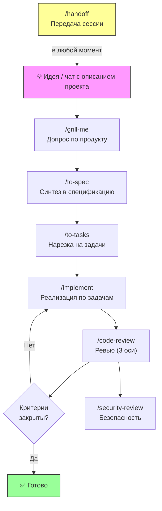

# AMANTLE UI — Отчёт о настройке проекта

> Все файлы, скиллы, конфигурации и документация проекта полностью размещены внутри Google Drive (`g:\Мой диск\__AMANTLE UI DESIGN SYSYTEM__`). Никакой зависимости от локального диска C: — при переносе на любое другое устройство или открытии через Google Drive всё сразу готово к работе!

---

## ✅ Что сделано

### 1. Все скиллы (27 штук) размещены прямо в Google Drive

Скиллы синхронизированы во все 4 ключевые директории проекта:
1. `skills/` — открытый каталог (виден в веб-интерфейсе Google Drive и на мобильных устройствах).
2. `.agents/skills/` — конфигурация для Antigravity IDE.
3. `.claude/skills/` — конфигурация для Claude Code.
4. `.codex/skills/` — конфигурация для Codex.

#### А. Основной конвейер разработки (7 скиллов из пакета)

| # | Скилл | Назначение | Кто запускает |
|---|---|---|---|
| 1 | `grill-me` | Допрос по продукту раундами (выявление требований и крайних случаев) | ТЫ (`/grill-me`) |
| 2 | `to-spec` | Разговор → спека `_specs/<slug>/spec.md` с критериями приёмки К1…Кn | ТЫ (`/to-spec`) |
| 3 | `to-tasks` | Спека → файлы задач с блокировками в `_specs/<slug>/tasks/` | ТЫ или автоматически |
| 4 | `implement` | Реализация задач по одной, коммиты, вызов ревью | ТЫ (`/implement`) |
| 5 | `code-review` | Ревью по 3 осям (стандарты, спека, безопасность) | Автоматически из implement |
| 6 | `security-review` | Справочник уязвимостей (OWASP, инъекции, XSS, SSRF и др.) | Автоматически из code-review |
| 7 | `handoff` | Сжатие контекста сессии в документ передачи | ТЫ (`/handoff`) |

#### Б. Скиллы для дизайна и фронтенда (7 скиллов)

| # | Скилл | Источник | Зачем для AMANTLE UI |
|---|---|---|---|
| 8 | `find-skills` | `vercel-labs/skills` | Поиск и установка любых новых скиллов |
| 9 | `find-animation-opportunities` | `emilkowalski/skills` | Поиск мест для микровзаимодействий и анимаций в UI |
| 10 | `nextjs-app-router-patterns` | `wshobson/agents` | Архитектура и паттерны Next.js App Router (RSC, streaming) |
| 11 | `interaction-design` | `wshobson/agents` | Проектирование микроинтеракций, состояний загрузки, жестов |
| 12 | `emil-design-eng` | `emilkowalski/skills` | Инженерия UI-дизайна от автора Sonner и Vaul |
| 13 | `api-and-interface-design` | `addyosmani/agent-skills` | Проектирование стабильных API и компонентных контрактов |
| 14 | `ui-animation` | `mblode/agent-skills` | Спринги, кривые, физика интерфейсных анимаций |

#### В. Системные workflow-скиллы ("Суперсилы", 13 скиллов)

| # | Скилл | Назначение |
|---|---|---|
| 15 | `brainstorming` | Креативный брейншторминг до кодирования |
| 16 | `writing-plans` | Составление структурированных планов реализации |
| 17 | `executing-plans` | Дисциплинированное выполнение планов |
| 18 | `subagent-driven-development` | Делегирование независимых задач сабагентам |
| 19 | `systematic-debugging` | Систематический поиск багов и первопричин без хаотичных правок |
| 20 | `test-driven-development` | TDD — разработка через тесты |
| 21 | `verification-before-completion` | Проверка всех команд и доказательств перед сдачей работы |
| 22 | `requesting-code-review` | Запрос независимого ревью кода |
| 23 | `receiving-code-review` | Обработка правок и замечаний ревью |
| 24 | `using-git-worktrees` | Изолированная разработка в git worktree |
| 25 | `using-superpowers` | Базовая координация скиллов |
| 26 | `finishing-a-development-branch` | Слияние и финализация ветки разработки |
| 27 | `dispatching-parallel-agents` | Параллельный запуск агентов на независимые таски |

---

### 2. Инициализирован Git-репозиторий на Google Drive

- Создан `.gitignore` (исключены `node_modules`, билд-артефакты, логи)
- Репозиторий полностью автономен внутри Google Drive

---

### 3. Созданы файлы инфраструктуры проекта в Google Drive

| Файл | Описание |
|---|---|
| [`AGENTS.md`](file:///g:/Мой диск/__AMANTLE UI DESIGN SYSYTEM__/AGENTS.md) | Главная инструкция для всех агентов: правила, стек, пути |
| [`_docs/project.md`](file:///g:/Мой диск/__AMANTLE UI DESIGN SYSYTEM__/_docs/project.md) | Бизнес-контекст: миссия, роли, ключевые принципы |
| [`_docs/stack.md`](file:///g:/Мой диск/__AMANTLE UI DESIGN SYSYTEM__/_docs/stack.md) | Стек проекта (Next.js App Router, React, Tailwind CSS, TypeScript) |
| [`_docs/design-system.md`](file:///g:/Мой диск/__AMANTLE UI DESIGN SYSYTEM__/_docs/design-system.md) | Дизайн-токены, переменные, цвета, типографика, спейсинги |
| [`_docs/SETUP_REPORT.md`](file:///g:/Мой диск/__AMANTLE UI DESIGN SYSYTEM__/_docs/SETUP_REPORT.md) | Этот отчёт о настройке и структуре проекта |

---

## 🔄 Порядок запуска скиллов конвейера



---

## 📁 Структура каталогов на Google Drive

```
g:\Мой диск\__AMANTLE UI DESIGN SYSYTEM__\
├── .agents/skills/            ← Скиллы для Antigravity IDE (27 шт.)
├── .claude/skills/            ← Скиллы для Claude Code (27 шт.)
├── .codex/skills/             ← Скиллы для Codex (27 шт.)
├── skills/                    ← Видимый каталог скиллов в Google Drive (27 шт.)
├── _docs/
│   ├── project.md             ← Концепция и цели
│   ├── stack.md               ← Технологический стек
│   ├── design-system.md       ← Дизайн-система и токены
│   └── SETUP_REPORT.md        ← Этот отчёт
├── .git/                      ← Локальный git-репозиторий
├── .gitignore
├── AGENTS.md                  ← Главные правила для ИИ-агентов
├── INSTALL.md                 ← Инструкция по установке
├── SKILLS-GUIDE.md            ← Подробное руководство по скиллам
├── skills-lock.json           ← Фиксация версий скиллов
└── Экосистема shadcn_ui.md    ← Базовое исследование экосистемы
```
