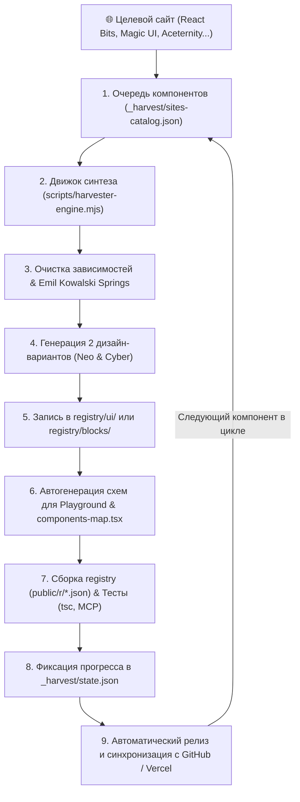

# Спецификация: Бесперебойный конвейер синтеза и портирования компонентов (Autonomous Component Harvester)

## 1. Постановка цели и концепция

Создание автономного конвейера по сайтам-донорам (React Bits, Magic UI, Aceternity UI, Kokonut UI, 21st.dev, Shadcn extensions), который по очереди обходит все компоненты целевого ресурса (строго исключая тяжелые фоны/backgrounds на Canvas/WebGL по правилам проекта), переносит их в дизайн-систему AMANTLE UI в стандартах React 19 + Next.js 15 + Tailwind CSS v4 + Emil Kowalski Spring Physics, генерирует альтернативные дизайн-варианты (Neo-Brutalist / Cyber-Glass) и автоматически регистрирует их в каталоге с прохождением тестов и деплоем.

## 2. Архитектура конвейера (Pipeline Architecture)

## 3. Источники и дорожная карта по сайтам

### Сайт 1: React Bits (https://reactbits.dev)
- **Категории:** Text Animations, UI Components, Micro-interactions, Visual Effects.
- **Исключения:** Heavy canvas/WebGL backgrounds (Fluid, Ballpit, Waves, Hyperspeed, etc.).
- **План компонентов (Batch 1-4):**
  - `text-pressure`, `glitch-text`, `variable-proximity`, `circular-text`, `wave-text`
  - `rolling-gallery`, `elastic-slider`, `flowing-menu`, `dock-mac`, `tilted-card`
  - `decay-card`, `spotlight-card`, `infinite-scroll`, `magnet`, `magnet-lines`
  - `crosshair`, `electric-border`, `fuzzy-text`, `splash-cursor`

### Сайт 2: Magic UI (https://magicui.design)
- **Категории:** Text, Buttons, Display, Layouts.
- **План компонентов:**
  - `marquee`, `animated-list`, `rainbow-button`, `animated-beam`
  - `orbiting-circles`, `avatar-circles`, `scratch-to-reveal`, `morphing-text`, `bento-grid`

### Сайт 3: Aceternity UI (https://ui.aceternity.com)
- **Категории:** Cards, Navigation, Borders, Effects.
- **План компонентов:**
  - `tracing-beam`, `sparkles`, `moving-border`, `glowing-stars`
  - `floating-navbar`, `evervault-card`, `hover-border-gradient`, `card-hover-effect`

### Сайт 4: Kokonut UI & 21st.dev
- **Категории:** Modern Inputs, AI Bars, Command Panels, Action Toolbars.
- **План компонентов:**
  - `action-bar-glow`, `ai-prompt-input`, `toolbar-expandable`, `status-tracker-card`

## 4. Контроль отказоустойчивости (Fault Tolerance & State)
- Все состояния сохраняются в `_harvest/state.json`.
- Каждый шаг обёрнут в `try/catch` с автоматическим сохранением стека ошибок в `_harvest/errors.log`.
- При сбое одного компонента процесс **не прерывается**: статус помечается как `ERROR`, записывается причина, и конвейер бесперебойно переходит к следующему компоненту в очереди.
- Поддержка продолжения (`--resume`) с любого места.
