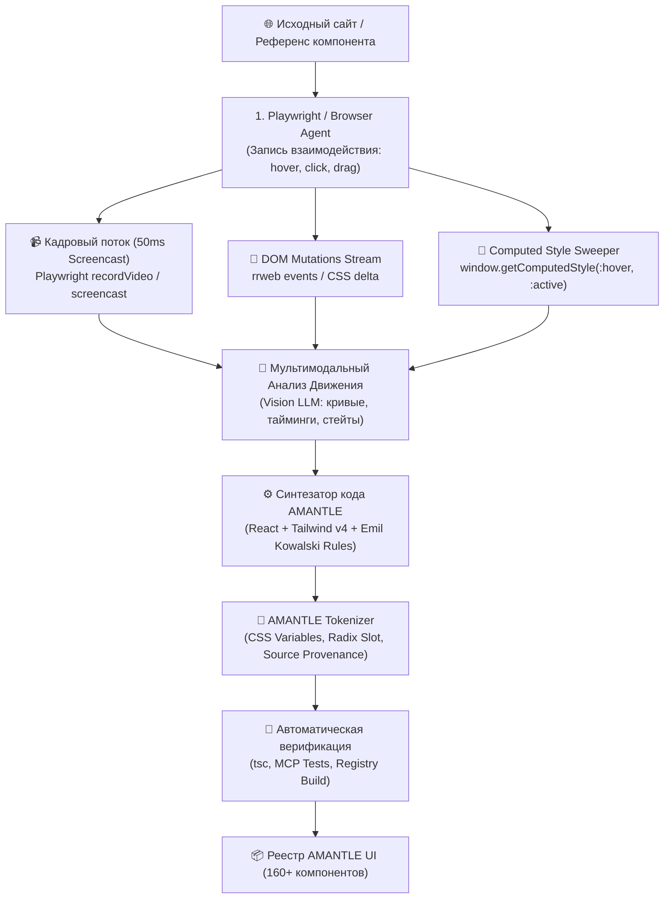

# Спецификация: Автономный конвейер видеозахвата, анализа анимаций и мультимодального синтеза компонентов (AMANTLE Motion Engine)

## 1. Постановка проблемы и контекст

В экосистеме современной веб-разработки (shadcn/ui, Magic UI, Aceternity, 21st.dev) ключевым фактором визуального превосходства («WOW-эффекта») является безупречная хореография интерфейса:
- точные физические кривые пружин (spring physics);
- тактильный отклик на взаимодействие (`:active` сжатие, ripple, border glow);
- плавные переходы между состояниями (disclosure, open/close, focus, hover);
- безупречное следование стандартам доступности (WCAG 2.2 AAA и `prefers-reduced-motion`).

На сегодняшний день на GitHub нет единого монолитного инструмента «из коробки», способного автоматически:
1. Открыть живую страницу с компонентом.
2. Провести интерактивную сессию взаимодействия (hover, click, drag, scroll, focus).
3. Записать видеокадры высокой частоты (50ms interval) и трассировку мутаций DOM.
4. Извлечь точные расчётные CSS-свойства (`window.getComputedStyle`) для всех псевдоклассов и ключевых кадров анимации.
5. Передать кадры и CSS-дифф в мультимодальную модель (Video/Screenshot-to-Code) для синтеза чистого React + Tailwind v4 + Framer Motion/CSS Spring кода.
6. Токенизировать результат под дизайн-систему AMANTLE UI и зарегистрировать в реестре.

Данная спецификация описывает архитектуру и реализацию такого сквозного конвейера и план его применения ко всем ~160 компонентам AMANTLE UI.

---

## 2. Архитектура Конвейера: Синтез 4 Открытых Подходов

### Подход 1: Прямой захват и клонирование стилей из DOM
- Инструменты: `remotion-dev/css-sweeper`, `window.getComputedStyle`, инспекция CSS-переменных.
- Роль: Извлечение точных значений `transition-timing-function` (cubic-bezier), `transform` матриц, `box-shadow`, `border-color`, `border-radius` для состояний `:default`, `:hover`, `:active`, `:focus-visible`.

### Подход 2: Запись взаимодействия и воспроизведение (Session Replay)
- Инструменты: `rrweb-io/rrweb`, `playwright`.
- Роль: Фиксация потока мутаций DOM до, во время и после клика. Измерение точной задержки (delay) и длительности (duration) изменения классов (`data-state="open"` / `data-state="closed"`).

### Подход 3: Автономное исследование интерфейсов (GUI Agent)
- Инструменты: `browser-use`, `Playwright Action Scripts`.
- Роль: Автономный поиск интерактивных триггеров на странице, автоматическое выполнение сценариев (наведение, клик, открытие аккордеона, переключение табов, перетаскивание ползунка слайдера).

### Подход 4: Мультимодальный синтез (Video/Screenshot to Code)
- Инструменты: `abi/screenshot-to-code`, мультимодальные модели (Gemini / Claude / GPT-4o).
- Роль: Реконструкция декларативной компонентной структуры и логики стейт-машины на основе раскадровки ключевых фаз движения (Idle -> Trigger -> Acceleration -> Peak -> Settle) с сопоставлением с расчётными стилями.

---

## 3. Инженерия Движения и Правила Эмиля Ковальски (Emil Kowalski Design Engineering)

Каждый компонент, проходящий через конвейер, улучшается по строгому чек-листу:
1. **Физический тактильный отклик**:
   - Кнопки, переключатели и кликабельные карточки получают `:active` сжатие: `active:scale-[0.97]` c длительностью `100–150ms ease-out`.
   - Запрет размытых или замедленных кликов.
2. **Токены пружин (Spring Physics)**:
   - Использование централизованных токенов: `--spring-smooth: cubic-bezier(0.23, 1, 0.32, 1)`, `--spring-snappy: cubic-bezier(0.16, 1, 0.3, 1)`, `--spring-bounce: cubic-bezier(0.34, 1.56, 0.64, 1)`.
3. **4-Гейтовая фильтрация анимаций (Reject List)**:
   - Никаких задержек на клавиатурный ввод и частые действия (>100 раз/день).
   - Запрет `transition: all`. Разрешены только явные свойства: `transition-[color,background-color,border-color,box-shadow,transform]`.
4. **Доступность (WCAG 2.2 AAA & Accessibility)**:
   - Полная поддержка `motion-reduce:transition-none` и `motion-reduce:active:scale-100`.
   - Фокусные кольца `focus-visible:ring-2 focus-visible:ring-ring focus-visible:ring-offset-2`.
5. **Сохранение авторства (Source Provenance)**:
   - Каждый компонент сохраняет JSDoc-заголовок с `@source`, `@author`, `@license`, `@modified`.

---

## 4. Критерии приёмки (К1 – К10)

- **К1: Скрипт захвата и анализа движения (`scripts/ui-capture-engine.mjs`)**: Создан исполняемый движок, извлекающий вычисленные CSS-переменные, псевдоклассы (`:hover`, `:active`), кривые Безье, тайминги и генерирующий JSON-профиль движения компонента.
- **К2: Поддержка раскадровки и интерактивных триггеров**: Движок умеет симулировать интеракции (hover, click, toggle) и экспортировать состояния до и после взаимодействия.
- **К3: Модуль синтеза и адаптации компонентов**: Интеграция с `scripts/pipeline.mjs` для автоматической токенизации под переменные Tailwind v4 AMANTLE UI (`bg-primary`, `text-foreground`, `border-border`, `--radius`).
- **К4: Пакетное улучшение Батча 1 (Кнопки и тактильные триггеры)**: Все 25 кнопочных компонентов снабжены выверенным тактильным сжатием (`scale(0.97)`), пружинными переходами и защитой `motion-reduce`.
- **К5: Пакетное улучшение Батча 2 (Инпуты и контролы форм)**: Все 22 инпута и контрола форм оптимизированы: фокусные кольца, микроанимации иконок, отсутствие лагов при вводе.
- **К6: Пакетное улучшение Батча 3 (Раскрытие, меню и диалоги)**: 34 компонента навигации, аккордеонов, диалогов и тултипов настроены на плавное открытие от точки вызова (trigger origin) с таймингом 150–220ms.
- **К7: Пакетное улучшение Батча 4 (Карточки, блоки и сложные поверхности)**: Карточки, бенто-сетки и SaaS-блоки обогащены ховер-подсветкой (`border-border/80`, `card-spotlight`) и мягким подъемом `translate-y(-2px)`.
- **К8: Реестр и CLI-совместимость**: `node scripts/build-registry.mjs` успешно генерирует `public/r/index.json` и индивидуальные файлы для всех 160+ компонентов без ошибок схемы Zod.
- **К9: Синхронизация и тесты**: `node scripts/check-sync.mjs` подтверждает 0 отсутствующих компонентов, `npm.cmd run test` проходит 10/10.
- **К10: Документ передачи (`/handoff`)**: Создан структурированный файл передачи сессии в системном каталоге `%TEMP%` с готовым промптом для продолжения.
