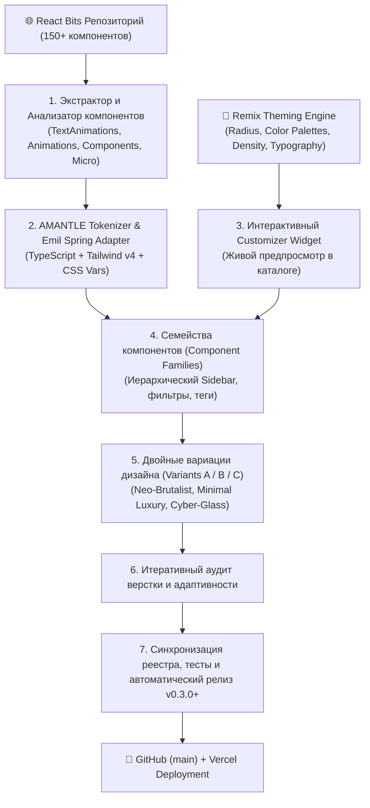

# Спецификация: AMANTLE UI v2 — Глубокий синтез React Bits, Дизайн-система с Remix/Theme Customizer, Иерархическая группировка компонентов и Мультивариативность

## 1. Постановка проблемы и бизнес-контекст

В текущей версии **AMANTLE UI (v0.2.2)** собрано 205 компонентов и блоков с базовым аудитом движения и MCP-интерфейсом. Однако для выхода на уровень флагманских экосистем (shadcn/ui v2, Magic UI, React Bits, 21st.dev) выявлены следующие архитектурные и продуктовые ограничения:

1. **Плоский каталог в сайдбаре:** 205 элементов свалены в линейный список, где трудно быстро ориентироваться (кнопки, градиентные кнопки, светящиеся кнопки, группы кнопок разбросаны в разных местах). Требуется строгая иерархическая группировка по «семействам» (Component Families: Buttons, Inputs, Cards, Navigation, Feedback, Typography, Layout, Visual Effects, Micro-Interactions).
2. **Отсутствие кастомизатора тем уровня shadcn Remix:** Пользователь не может на лету менять скругления (`border-radius`: 0px, 4px, 8px, 12px, 16px, 9999px), глобальную цветовую палитру (Zinc, Slate, Stone, Emerald, Blue, Violet, Rose, Amber), шрифтовые пары и плотность интерфейса в живом предпросмотре.
3. **Недостаток высокохудожественных микровзаимодействий и текстовых анимаций:** Библиотека React Bits (`reactbits.dev`) содержит более 150 передовых компонентов анимаций текста, микро-интерактивов и визуальных эффектов (исключая тяжелые фоны/backgrounds, запрещенные пользователем). Необходим дотошный анализ, извлечение логики, портирование в стек React 19 + Tailwind v4 + Emil Kowalski Spring Physics и токенизация.
4. **Ошибки верстки и адаптивности в существующих компонентах:** Неровности, некорректный перенос длинного текста, отсутствие flex-wrap, скачки layout при ховере. Необходим итеративный аудит и устранение багов.
5. **Мультивариативность (Design Variants):** Пользователю нужны альтернативные стилистические вариации каждого ключевого элемента (например, Neo-Brutalist, Minimal Apple-like, Cyberpunk/Glow Glassmorphism), дающие свободу выбора для любого проекта.

---

## 2. Архитектура решения и компоненты системы

---

## 3. Критерии приёмки (Acceptance Criteria)

### К1. Дизайн-система Remix & Theme Customizer
- [ ] В приложении доступен плавающий/закрепляемый виджет настройки тем (Remix Toolbar / Customizer).
- [ ] Поддерживается переключение радиуса скругления через CSS-токен `--radius` (значения: `0rem` [sharp/brutalist], `0.3rem` [compact], `0.5rem` [default], `0.75rem` [soft], `1.0rem` [rounded], `9999px` [pill]).
- [ ] Поддерживается выбор базовой цветовой гаммы (Zinc, Slate, Stone, Emerald, Blue, Violet, Rose, Amber) с автоматическим обновлением CSS-переменных `--primary`, `--ring`, `--accent`, `--border`.
- [ ] Настройки темы сохраняются в `localStorage` и применяются ко всем превью и песочнице в реальном времени без перезагрузки страницы.

### К2. Иерархическая группировка компонентов (Component Families Sidebar)
- [ ] В `sidebar-catalog.tsx` и `interactive-showcase.tsx` компоненты сгруппированы по логическим семействам (Accordion Families):
  - **Кнопки и Действия (Buttons & Actions):** `button`, `button-gradient-flow`, `button-glow`, `button-magnetic`, `button-shimmer`, `button-split`, `button-group`, `specular-button`, `fuse-button`, `sling-button`...
  - **Формы и Ввод (Inputs & Controls):** `input`, `input-otp`, `curved-input`, `checkbox`, `radio-group`, `switch`, `squish-switch`, `slider`, `elastic-slider`, `select`, `glide-select`...
  - **Карточки и Контейнеры (Cards & Surfaces):** `card`, `card-hover-effect`, `decay-card`, `pixel-card`, `spotlight-card`, `tilted-card`, `reflective-card`, `flip-card`...
  - **Навигация и Меню (Navigation & Menus):** `dock`, `pill-nav`, `card-nav`, `gooey-nav`, `bubble-menu`, `infinite-menu`, `staggered-menu`, `breadcrumbs`, `tabs`, `animated-tabs`...
  - **Текстовая анимация и Типографика (Text & Typography):** `split-text`, `blur-text`, `shiny-text`, `decrypted-text`, `true-focus`, `gradient-text`, `count-up`, `rotating-text`, `text-pressure`, `glitch-text`...
  - **Микровзаимодействия и Индикаторы (Micro & Feedback):** `badge`, `badge-verified-tier`, `warm-tooltip`, `jelly-radio`, `spring-check`, `pulse-heart`, `progress`, `slosh-gauge`, `swipe-toast`...
  - **Визуальные эффекты (Visual & Motion FX):** `crosshair`, `click-spark`, `magnet`, `magnet-lines`, `star-border`, `electric-border`, `dither-veil`, `laser-flow`, `elastic-mesh`...
  - **Блоки и Лейауты (Composite Blocks):** Hero, Pricing, Testimonials, FAQ, Footers, Bento-сетки...
- [ ] Сайдбар поддерживает сворачивание/разворачивание групп, быстрый поиск и счетчик элементов в каждом семействе.

### К3. Анализ и интеграция ключевых компонентов React Bits (за вычетом бэкграундов)
- [ ] Проанализированы исходники React Bits (`TextAnimations`, `Animations`, `Components`, `Micro`).
- [ ] Новые высокотехнологичные компоненты портированы в `registry/ui/` с соблюдением стандартов проекта (TypeScript, Tailwind v4, Emil Kowalski spring easing, JSDoc provenance headers `@source reactbits.dev`).
- [ ] Все новые компоненты зарегистрированы в `lib/components-map.tsx` и `public/r/*.json`.

### К4. Итеративный аудит верстки, типографики и адаптивности
- [ ] Проверен каждый компонент на предмет:
  - корректного поведения при длинном тексте (отсутствие горизонтального вылезания, правильные `truncate` / `break-words`);
  - мобильной адаптивности (компоненты не ломают ширину вьюпорта на экранах от 320px до 1920px);
  - отсутствия визуальных артефактов при наведении и нажатии.
- [ ] Исправлены все найденные визуальные дефекты.

### К5. Вариативность дизайна (2 альтернативных стиля под ключевые примитивы)
- [ ] Для ключевых интерфейсных компонентов добавлены стилевые модификаторы / варианты:
  - Вариант 1 (Default / Modern Clean): утонченный минимализм shadcn-style.
  - Вариант 2 (Neo-Brutalist / Bold Kinetic): контрастные рамки, жесткие тени (`shadow-[3px_3px_0px_#000]`), дерзкие акценты.
  - Вариант 3 (Cyber / Glassmorphic Ambient Glow): подложки `backdrop-blur-md`, тонкие градиентные бордеры, светящиеся ауры.

### К6. Сквозная верификация, CI и деплой
- [ ] `npx tsc --noEmit` завершается с кодом 0 (0 ошибок типов).
- [ ] `npm run test` (MCP тесты) завершается со 100% успехом.
- [ ] `node scripts/check-sync.mjs` подтверждает полное совпадение реестра (0 missing).
- [ ] Next.js `npm run build` компилируется без ошибок.
- [ ] Автоматический выпуск нового релиза через `npm run deploy` с созданием git commit, git tag и пушем в GitHub `origin main`.

---

## 4. Швы для автоматического тестирования

1. **MCP Server Tool Test (`scripts/test-mcp.mjs`):** проверка поиска по новым категориям, извлечение кода новых компонентов, получение токенов для новых тем.
2. **Registry Sync Verification (`scripts/check-sync.mjs`):** сверка `public/r/index.json` и `lib/components-map.tsx`.
3. **Typecheck & Linter (`tsc --noEmit`):** проверка целостности типов всех TSX файлов.
4. **Production Build (`npm run build`):** гарантия компиляции всех SSR/SSG страниц и клиентских бандлов.
